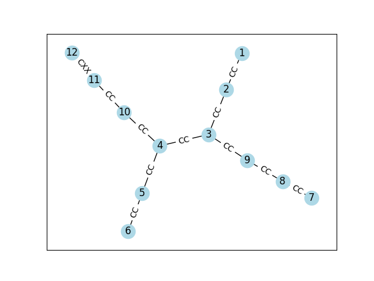
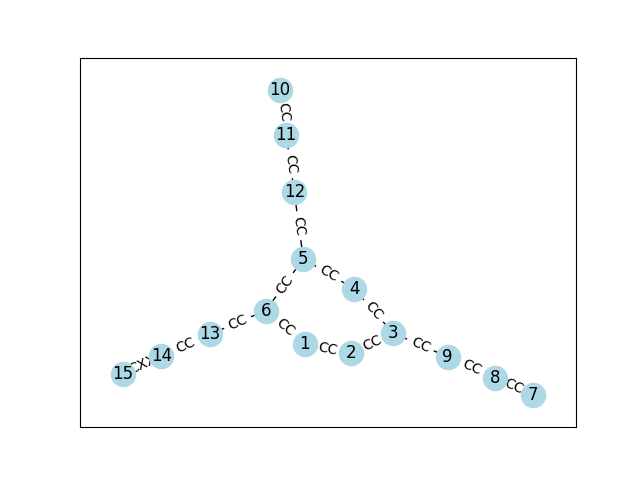
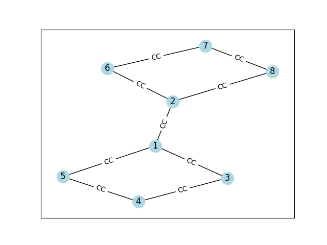
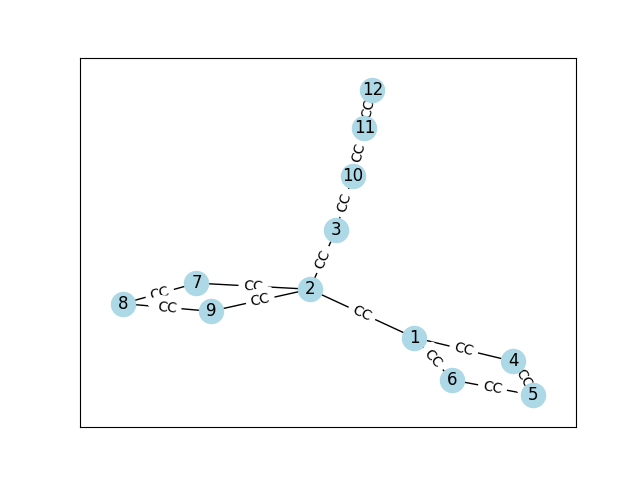
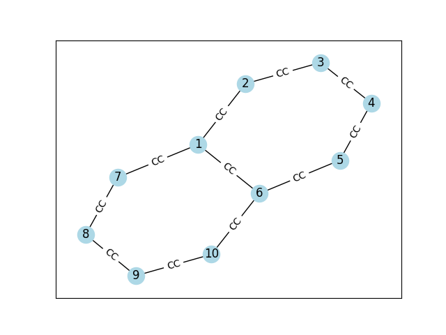

# 🧬 Graph

In this section, we will describe how to create a molecule graph using a predefined molecule source. The molecule source defines the main chain and any additional chains that are part of the molecule.

## Molecule Source 🧪

The molecule source is defined as a dictionary where each key represents a chain, and the value is a list of strings representing the connections between atoms in that chain.

```python
# molecule source
molecule_src = {
    'MainChain': ["C1-C2", "C2-C3", "C3*{Chain1}", "C3-C4", "C4*{Chain2}", "C4-C5", "C5-C6"],
    'Chain1': ["C1=C2", "C2-C3", "C3=*"],
    'Chain2': ["*-C1", "C1=C2", "C2-XX3"]
}

# create molecule graph
mol_graph = mi.create_molecule_graph(molecule_src, molecule_name='my_molecule')

# display molecule graph
mol_graph.d("my_molecule")
```



```python
molecule_src = {
    'MainChain': ["C1-C2", "C2=C3", "C3-C4", "C3*{Chain1}", "C4=C5", "C5*{Chain1}", "C5-C6", "C6=C1", "C6*{Chain2}"],
    'Chain1': ["C1=C2", "C2-C3", "C3=*"],
    'Chain2': ["*-C1", "C1=C2", "C2-XX3"]
}
```



```python
molecule_src = {
    'MainChain': ["C1*{Chain1}", "C1-C2", "C2*{Chain2}"],
    'Chain1': ["*-C1", "C1=C2", "C2-C3", "C3=*"],
    'Chain2': ["*-C1", "C1=C2", "C2-C3", "C3=*"],
}
```



```python
molecule_src = {
    'MainChain': ["C1*{Chain1}", "C1-C2", "C2*{Chain2}", "C2-C3", "C3*{Chain3}"],
    'Chain1': ["*-C1", "C1=C2", "C2-C3", "C3=*"],
    'Chain2': ["*-C1", "C1=C2", "C2-C3", "C3=*"],
    'Chain3': ["*-C1", "C1=C2", "C2-C3"],
}
```



```python
# naphthalene
molecule_src = {
    'MainChain': ["C1-C2", "C2=C3", "C3-C4", "C4=C5", "C5-C6", "C6=C1", "C1*{Chain1}", "C6*{Chain1}"],
    'Chain1': ["*-C1", "C1=C2", "C2-C3", "C3=C4", "C4-**"],
}
```

